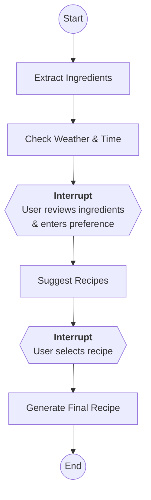

# Recipe Helper – AI‑Powered Recipe Recommendation System (LangGraph Edition)

Recipe Helper is an AI‑powered culinary companion that turns photos of your pantry into delicious meal ideas. After implementing the core GenAI pipeline in Part A, this refactored version introduces **LangGraph** orchestration and **situational context** (weather and time) to satisfy the Part B learning challenge from the technical assessment. The application now executes as a stateful graph with human‑in‑the‑loop pauses and enriches model prompts with live weather data and the current time in Dublin.

## Documentation Map

| File | Audience | Purpose |
| :---- | :---- | :---- |
| **README.md (this file)** | Users / Developers | Project overview, setup, running instructions, architectural design and trade‑offs, and limitations. |
| **project‑prompt.md** | Developers | Blueprint for recreating this version of the project from scratch, including high‑level requirements, module responsibilities and development guidelines. |
| **learning.md** | Team / Reviewers | Reflection on the Part B learning challenge: resources consulted, challenges encountered, and insights gained from using LangGraph and integrating external data. |
| **.agent/agents.md** | AI Agents | Context and constraints for AI code generation, including safety, coding standards and agent workflows. |
| **.agent/rules/python‑standards.md** | Developers / AI Agents | Detailed Python coding standards used throughout the project. |

## What’s New in the LangGraph Edition

This iteration extends the original recipe helper to explore a new GenAI framework and tool integration. The key changes are:

* **Agent‑style orchestration with LangGraph:** The core workflow has been refactored into a **five‑node state machine** implemented in src/graph.py. The nodes execute in sequence and pause to allow user input:  

  1\) **Extract ingredients** decodes image bytes, calls the vision model and clears the image from state to reduce checkpoint size[\[1\]](https://raw.githubusercontent.com/amcegan/recipe-helper/main/src/graph.py#:~:text=def%20extract_ingredients_node,Image%20type%3A%20%7Btype%28state.get%28%27image).  

  2\) **Check weather** retrieves a city‑based forecast from *wttr.in*, validates it via a Pydantic model and formats a concise context string including the current Dublin time[\[2\]](https://raw.githubusercontent.com/amcegan/recipe-helper/main/src/graph.py#:~:text=def%20get_weather_context%28%29%3A%20,Dublin). 

  3\) **Suggest recipes** invokes RecipePipeline.suggest\_recipes() with the detected ingredients, the user’s preference and the weather/time context[\[3\]](https://raw.githubusercontent.com/amcegan/recipe-helper/main/src/graph.py#:~:text=def%20check_weather_node,context).   

  4\) **Human review** pauses execution so the user can choose one of the suggested recipes. 

  5\) **Generate final recipe** calls generate\_final\_recipe() with the selected title and context[\[4\]](https://raw.githubusercontent.com/amcegan/recipe-helper/main/src/graph.py#:~:text=def%20create_recipe_graph).
  

* **Situational awareness:** Prompts are now enriched with situational context. The get\_weather\_context() function fetches the current temperature and weather description for a configurable city (default “Dublin”) and combines it with the local time[\[2\]](https://raw.githubusercontent.com/amcegan/recipe-helper/main/src/graph.py#:~:text=def%20get_weather_context%28%29%3A%20,Dublin). This string is passed through the graph and into the recipe prompts so that the model can tailor its suggestions to cold rainy evenings or sunny afternoons.

* **Three‑stage Streamlit UI:** The user interface in src/ui.py has been updated to mirror the graph stages. After uploading an image and clicking **Detect Ingredients**, the app shows both the weather/time context and the list of detected ingredients. The user can then enter a preference and click **Generate Recipe Suggestions**, which resumes the graph at the “suggest\_recipes” node. Finally, selecting a suggestion from the drop‑down and clicking **Get Final Recipe** resumes the graph to produce the detailed recipe[\[5\]](https://raw.githubusercontent.com/amcegan/recipe-helper/main/src/ui.py#:~:text=,%2A%2AContext%3A%2A%2A%20%7Bst.session_state.graph_state%5B%27context).

* **Image and state handling:** Images are converted to bytes before being stored in the graph state to ensure compatibility with the MemorySaver checkpoint system. After ingredient extraction, the image is set to None to minimise the size of checkpointed state[\[1\]](https://raw.githubusercontent.com/amcegan/recipe-helper/main/src/graph.py#:~:text=def%20extract_ingredients_node,Image%20type%3A%20%7Btype%28state.get%28%27image). Additional fields in the RecipeState TypedDict track context, suggestions, user preference and the final recipe[\[6\]](https://raw.githubusercontent.com/amcegan/recipe-helper/main/src/schemas.py#:~:text=class%20RecipeState%28TypedDict%29%3A%20,FinalRecipe%5D%20request_id%3A%20str).

* **Expanded schemas and validation:** The WeatherResponse, CurrentCondition and WeatherDesc Pydantic models have been added to src/schemas.py to validate the weather API response before use[\[7\]](https://raw.githubusercontent.com/amcegan/recipe-helper/main/src/schemas.py#:~:text=class%20WeatherDesc). The recipe pipeline methods now accept a context parameter and include it in the prompts[\[8\]](https://raw.githubusercontent.com/amcegan/recipe-helper/main/src/recipes.py#:~:text=def%20suggest_recipes%28self%2C%20ingredients%3A%20List,preference).

* **New environment variables:**

* LOCATION\_CITY – optional; defaults to “Dublin”. Determines which city to query from wttr.in.

* GEMINI\_API\_KEY, LOG\_LEVEL and INGREDIENT\_CONFIDENCE\_THRESHOLD from the original version are still used.

* **Additional dependencies:** The refactor introduces langgraph and requests. See requirements.txt for exact versions.

## Workflow Orchestration

The application follows a three-stage orchestrated flow with two state-managed interrupts (if the following diagram does not display please install the Markdown Preview Mermaid Support extension for VSCode):

## Architectural Design & Decisions

The system remains modular, with clear separation between the service layer and the UI, but the control flow is now managed by LangGraph. A StateGraph is compiled with MemorySaver to persist state between pauses. Each node encapsulates a single responsibility:

1. **extract\_ingredients\_node** – decodes image bytes, calls the vision model and returns a list of Ingredient objects. It nulls out the image in the returned state to reduce checkpoint size[\[1\]](https://raw.githubusercontent.com/amcegan/recipe-helper/main/src/graph.py#:~:text=def%20extract_ingredients_node,Image%20type%3A%20%7Btype%28state.get%28%27image).

2. **check\_weather\_node** – calls get\_weather\_context() to fetch a concise weather/time string and returns it as context[\[2\]](https://raw.githubusercontent.com/amcegan/recipe-helper/main/src/graph.py#:~:text=def%20get_weather_context%28%29%3A%20,Dublin).

3. **suggest\_recipes\_node** – instantiates RecipePipeline and calls suggest\_recipes() with ingredients, the user’s preference and the context[\[3\]](https://raw.githubusercontent.com/amcegan/recipe-helper/main/src/graph.py#:~:text=def%20check_weather_node,context).

4. **human\_review\_node** – intentionally does nothing except pause the graph; Streamlit resumes it when the user has selected a recipe.

5. **generate\_final\_recipe\_node** – calls RecipePipeline.generate\_final\_recipe() with the selected suggestion title, ingredients, user preference and context[\[4\]](https://raw.githubusercontent.com/amcegan/recipe-helper/main/src/graph.py#:~:text=def%20create_recipe_graph).

Pausing before the suggestion and review nodes allows the UI to collect user input (preference and chosen recipe). This design demonstrates how agent frameworks can orchestrate multi‑step workflows with human intervention.

## Setup Instructions

### Prerequisites

1. **Python 3.9+**

2. **Google Gemini API Key** – sign up via Google AI Studio.

### Installation

1. **Create and activate a virtual environment** (recommended):

python3 \-m venv venv  
source venv/bin/activate  \# or \`venv\\Scripts\\activate\` on Windows

1. **Install dependencies**:

pip install \--upgrade pip  
pip install \-r requirements.txt

1. **Configure environment variables**:

Copy .env.example to .env and set the following keys:

* **GEMINI\_API\_KEY** – your Google Gemini API key.

* **LOCATION\_CITY** (optional) – city for wttr.in weather look‑ups (default: Dublin).

* **LOG\_LEVEL** (optional) – DEBUG for verbose logs or INFO for typical output.

* **INGREDIENT\_CONFIDENCE\_THRESHOLD** (optional) – float between 0.0 and 1.0 to filter low‑confidence ingredient detections.

Never commit your API keys to version control. The application uses python‑dotenv to load these values at runtime.

## Running the Application

Run the Streamlit server from the project root:

streamlit run main.py

The flow is:

1. **Upload an image** of your ingredients (PNG/JPG).

2. Click **Detect Ingredients**. The graph runs the extraction and weather nodes and displays both the detected ingredients and a context message such as “It is currently 11 °C and light rain in Dublin at 5 PM.”

3. **Enter a preference** (e.g. “quick vegetarian lunch”) and click **Generate Recipe Suggestions**. The graph resumes at the suggestion node, passes your preference and context into the prompt, and returns 3–5 recipe ideas.

4. **Select a suggestion** from the list and click **Get Final Recipe**. The graph resumes at the final node and produces a detailed recipe with ingredients, instructions, cooking time and chef’s notes.

If the app cannot find your API key or encounters an error, a descriptive message will appear. Check your .env configuration and the logs for details.

## Running Tests

Unit tests cover the vision and recipe pipelines, validators and the new weather functionality. To run the tests:

pytest tests/

The tests mock external API calls so they do not require network access or valid API keys. They verify success paths, error handling, retry behaviour and the proper propagation of the context string through the graph.

## Technology Choices

| Technology | Role | Rationale |
| :---- | :---- | :---- |
| **LangGraph** | Agent framework | Provides a stateful graph abstraction with built‑in checkpointing and human‑in‑the‑loop interruption. This enables multi‑step reasoning and clean separation between nodes. |
| **Gemini 2.0 Flash** | Vision & text LLM | Offers integrated multi‑modal support and structured JSON output via response\_schema, reducing prompt engineering overhead. |
| **Streamlit** | UI framework | Simplifies building interactive Python apps without HTML/JS; ideal for demonstrating the workflow. |
| **Pydantic v2** | Data validation & typing | Ensures AI and weather API responses conform to expected schemas; reduces runtime errors and simplifies downstream code. |
| **Tenacity** | Retry logic | Provides exponential backoff and logging hooks to make external calls resilient to transient failures. |
| **Requests** | HTTP client | Used to call the wttr.in weather API. |
| **System Time** | Time handling | Generates the current time based on the server's local system time. |
| **Pillow (PIL)** | Image handling | Lightweight, robust library for reading and manipulating images. |
| **python‑dotenv** | Secret management | Loads environment variables from a .env file, keeping secrets out of source control. |

## Limitations & Future Improvements

* **Limited weather granularity:** The weather context uses the first entry of current\_condition from wttr.in and may not capture hourly variations. 

* **Weather service has no SLA:** wttr.in is a community service; not ideal for guaranteed SLA/production. It was used as it does not require an API key and a city can be specified as a query parameter which is a lot easier than latitude/longitude required by open-meteo.com.

* **System Time Dependency:** The time is generated from the system's local clock so it is not ideal for production.

* **No persistence or personalisation:** Session data is stored in memory via Streamlit’s session state. A production service would persist user history, preferences and feedback in a database.

* **Single‑user concurrency:** Streamlit’s single‑process nature means the app is not suited to high‑traffic scenarios. The core service layer could be exposed via a REST or gRPC API and the UI served separately for scalability.

* **Partial test coverage:** While the unit tests cover critical functions, integration tests for the LangGraph orchestration and UI are limited. More comprehensive end‑to‑end tests and performance benchmarks would be beneficial.

## Part B Reflection

This project fulfills the "Learning & Exploration Challenge" of the technical interview assessment. 
- **Google Antigravity**: While I had used this tool for small personal projects, this assessment allowed me to apply it to a production-like scenario.
- **Gemini 2.0 Flash**: I chose this model to explore its **multimodal ease of use**, specifically how it simplifies architecture by handling both vision and complex reasoning in a single call with structured JSON output.
- **LangGraph**: I had used LangGraph previously, but this project was my first opportunity to implement the newer **Human-in-the-Loop (HITL)** features, using interrupts to guide the user flow.

See `LEARNING.md` for a deeper dive into these technical choices and the lessons learned.

## Production Deployment Considerations

To transition this proof-of-concept into a production-grade service, the following architectural changes would be required:

1.  **State Persistence**: Replace the in-memory `MemorySaver` with a durable backend like **PostgreSQL** (using `AsyncPostgresSaver`) or Redis. This ensures user sessions survive service restarts and allows for horizontal scaling.
2.  **Scalable Serving**: Decouple the Streamlit UI from the core logic. Deploy the LangGraph application as a **FastAPI** microservice (using LangServe) to handle high concurrency and provide a clean REST API for multiple front-ends (web, mobile).
3.  **Time & Localization**: Remove reliance on server system time. Use the user's browser/client to send their local timezone or geolocation for accurate time and weather context.
4.  **Weather Service SLA**: Replace the community-hosted `wttr.in` with a commercial provider (e.g., OpenWeatherMap or Google Maps Platform) to guarantee uptime and latency SLAs.
5.  **Observability**: Integrate structured logging (e.g., OpenTelemetry) to trace requests across the graph nodes and monitor LLM latency/costs in real-time.

## Edge Case Handling & Robustness

The assessment requires demonstrating how the system handles failures and edge cases. This implementation addresses several robustness scenarios:

1.  **External API Failure (Weather)**: The `get_weather_context` function uses a `try-except` block. If `wttr.in` is unreachable or returns invalid data, the system gracefully degrades to a "mild weather" default rather than crashing the entire recipe flow.
2.  **Transient Network Errors**: All Gemini API calls in `src/vision.py` and `src/recipes.py` are wrapped with the `@retry` decorator from the `tenacity` library. This handles temporary hiccups (like rate limits or timeouts) by automatically retrying with exponential backoff.
3.  **Low-Confidence Detections**: The vision pipeline implements a filter (`INGREDIENT_CONFIDENCE_THRESHOLD`) to silently discard hallucinations or uncertain ingredients, ensuring only high-quality data reaches the recipe generator.
4.  **LLM Output Validation**: We do not blindly trust the AI. Every response is parsed and immediately validated against Pydantic models. If the schema doesn't match, an `AppValidationError` is raised immediately, preventing "silent failures" downstream.
5.  **Graph State Serialization**: To prevent the "Un-serializable Data" edge case common in distributed graphs, the `extract_ingredients_node` enforces that images are strictly converted to `bytes` and then cleared (`None`) after processing to keep checkpoints lightweight.

---